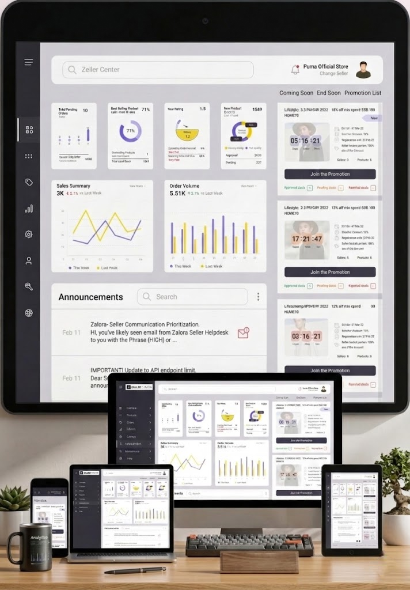
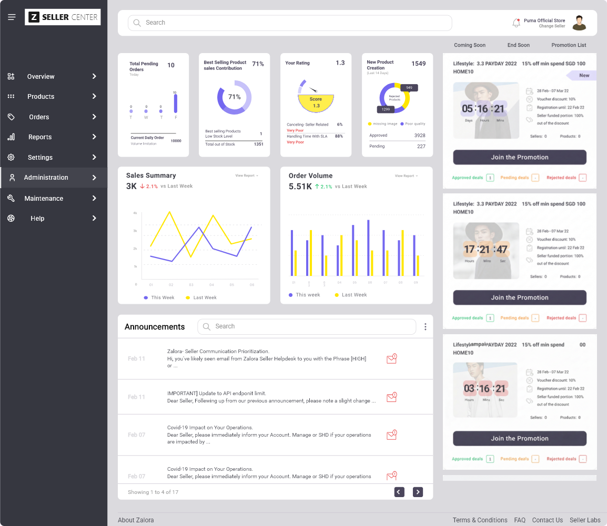

# 📊 Responsive Dashboard

A **Flutter** dashboard application built as a training project to practice **Responsive & Adaptive UI** design. This was a task for the **IEEE** team — implementing a main dashboard that adapts seamlessly across desktop, tablet, and mobile screens.

---

<p align="center">
  
</p>

---

## ✨ Features

- 🖥️ **Desktop Layout** — Full sidebar navigation with expanded dashboard view
- 📱 **Tablet Layout** — Compact sidebar with adjusted content grid
- 📲 **Mobile Layout** — Bottom/drawer navigation with stacked content
- 📊 **Dashboard Cards** — Info cards, charts (SVG), and announcements
- 🎨 **Custom Fonts** — Roboto, Public Sans, Poppins, Mulish
- 🖼️ **SVG Assets** — Scalable vector icons and chart graphics
- 🔍 **Device Preview** — Test responsiveness using `device_preview` package

---

## 📸 Screenshots

### 🖥️ Desktop View
<p align="center">
  
</p>

### 📱 Tablet View
<p align="center">
  
</p>

### 📲 Mobile View
<p align="center">
  
</p>

---

## 🛠️ Tech Stack

| Technology | Usage |
|---|---|
| **Flutter** | UI Framework |
| **Dart** | Programming Language |
| **flutter_svg** | Rendering SVG assets |
| **device_preview** | Testing responsiveness on various devices |

---

## 🏗️ Project Structure

```
lib/
├── main.dart
├── home_view.dart
├── layout/
│   ├── adaptive_layout.dart
│   ├── desktop_layout.dart
│   ├── tablet_layout.dart
│   └── mobile_layout.dart
├── views/
│   ├── Dash_board_view.dart
│   ├── desktop_body_view.dart
│   ├── desktop_drawer.dart
│   ├── tablet_body_view.dart
│   ├── tablet_drawer.dart
│   └── promotion_list_view.dart
├── widgets/
│   ├── info_card.dart
│   ├── info_cards.dart
│   ├── announcements_widget.dart
│   ├── search_bar_widget.dart
│   ├── drawer_listView.dart
│   └── ...
├── models/
│   └── drawer_item_model.dart
└── utils/
    ├── app_styles.dart
    ├── const_colors.dart
    ├── get_responsive_size.dart
    └── ...
```

---

## 🚀 Getting Started

1. **Clone the repository**
   ```bash
   git clone https://github.com/<your-username>/responsive-dashboard.git
   ```
2. **Install dependencies**
   ```bash
   flutter pub get
   ```
3. **Run the app**
   ```bash
   flutter run
   ```

---

## 🧠 What I Learned & Applied

### 📐 Responsive vs Adaptive UI
- **Responsive UI** — The layout *flexes and scales* based on screen size (e.g., font sizes, spacing, card ratios adjust dynamically)
- **Adaptive UI** — The layout *completely changes structure* based on breakpoints (e.g., showing a different layout for mobile vs desktop)

### 🔧 Key Concepts Applied

#### 1. `LayoutBuilder` + Breakpoints
Used `LayoutBuilder` to read the available `maxWidth` constraints and switch between **3 completely different layouts** based on breakpoints:
- `< 600px` → Mobile Layout
- `600px – 900px` → Tablet Layout
- `≥ 900px` → Desktop Layout

#### 2. `MediaQuery`
Used `MediaQuery.sizeOf(context)` to conditionally show/hide widgets — for example, showing `MobileAppBar` only when `width <= 600`.

#### 3. Custom Responsive Font Sizing
Built a `getResponsiveSize()` utility function that:
- Calculates a **scale factor** based on screen width for each breakpoint range
- Uses `.clamp()` to keep font sizes within **80% – 120%** of the base size
- Prevents text from becoming too small or too large on extreme screen sizes

#### 4. `Expanded` with Flex Ratios
Used `Expanded` with specific **flex values** (like `flex: 255` for drawer, `flex: 1162` for body) to create proportional layouts that match the Figma design precisely.

#### 5. Adaptive Navigation
Implemented **3 different navigation patterns** for the same app:
- 🖥️ **Desktop** → Full sidebar drawer with text labels + icons
- 📱 **Tablet** → Icon-only compact sidebar with selected state indicator
- 📲 **Mobile** → Custom `AppBar` (no sidebar at all)

#### 6. `GridView` with Dynamic `crossAxisCount`
Used `GridView.builder` with `SliverGridDelegateWithFixedCrossAxisCount` where `crossAxisCount` changes based on `isMobile` flag — showing cards in **2 columns on mobile** vs **4 columns on desktop/tablet**.

#### 7. `FittedBox`
Used `FittedBox` to ensure widgets like images and logos scale down gracefully without overflow.

#### 8. `CustomScrollView` + Slivers
Used `CustomScrollView` with `SliverToBoxAdapter` and `SliverList.builder` for efficient scrollable layouts in the drawer.

#### 9. `device_preview` Package
Integrated [device_preview](https://pub.dev/packages/device_preview) to test the app on various virtual devices directly during development (enabled only in debug mode via `!kReleaseMode`).

#### 10. Clean Architecture Separation
Organized code into a clear structure:
- **`layout/`** → Adaptive layout logic (which layout to show)
- **`views/`** → Screen-specific views (desktop body, tablet drawer, etc.)
- **`widgets/`** → Reusable UI components (info cards, search bar, etc.)
- **`utils/`** → Helpers (responsive sizing, colors, styles, asset paths)
- **`models/`** → Data models

---

## 📚 Learning Resources

- 📺 [Flutter Responsive UI Playlist (Recommended for Mobile)](https://www.youtube.com/playlist?list=PLwWuxCLlF_ue_b0RZ_t6qjf_Nupkdq9BE)
- 📺 [Flutter Responsive Design Tutorial](https://www.youtube.com/watch?v=9bo1V9STW2c&list=LL&index=4)
- 🎓 [Mastering Flutter: Responsive & Adaptive UI Design [Arabic] (Recommended for Dashboard)](https://www.udemy.com/course/mastering-flutter-responsive-adaptive-ui-design-arabic/)

---

## 📄 Design

The UI is based on a **Figma design** included in the repository (`Figma Design.fig`).

---

<p align="center">
  Made with ❤️ for IEEE
</p>

